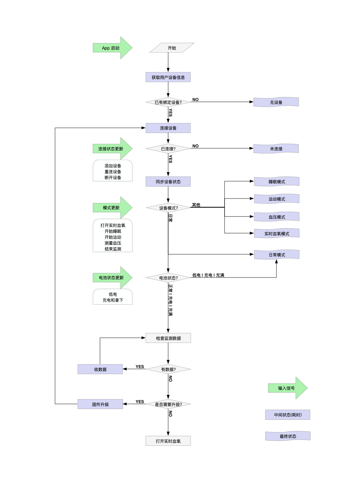

[EN](./README.md) | 中文

MegaRing SDK & Demo for iOS in Objective-C

为了更容易理解硬件和 SDK 的使用, 下面给出了指环的几个特征和 SDK 一些组件的说明;

## 关于指环
### 连接和用户身份校验
- 已绑定用户连接时需要提供用户 id 和 token, 新用户连接只需要提供 id; 
- 连接完成后会生成一个 token, 以供下次连接使用;

### 监测
- 连接指环后可以通过手机开关监测; 
- 开启实时数据的作用是每秒收到血氧和脉率的值; 
- 监测可能在一些情况下自动结束, 如低电, 充电, 空间已满, 超过 12 小时等;

### 数据
- 每监测 82 秒产生 256 字节的数据; 
- 结束监测时指环里会保存这次监测的数据, 其中不足 256 字节的部分会被舍去; 
- 数据在被收取后自动删除; 
- 指环内部空间能存储 12 小时的睡眠监测, 建议在开始新的监测前检查收取数据;

## 关于 SDK

### 初始化

	+[MRApi setUpWithAppId:appKey:];

### 连接过程

1. 注册通知 kMRCentralStateUpdatedNotification 可以观察系统蓝牙的状态; 设置 [MRConnecter defaultConnecter].delegate;
2. 调用 -[MRConnecter startScanning] 开始扫描设备, 确保设备电量充足并在可连接范围内;
3. 实现 -[MRConnecterDelegate connecter:didDiscoverDevice:], 设备被搜索到时会调用此方法;
4. 搜索到目标设备后调用 -[MRConnecter connectDevice:] 连接该设备;
5. 实现 -[MRConnecterDelegate connecter:didUpdateDeviceConnectState:], 设备被连接后会调用此方法;
6. 调用 -[MRConnecter stopScanning] 停止扫描，或者通过设置 `autoStopScanning = true` 在连接设备后自动终止扫描;

### 绑定过程

1. 设置 MRDevice.delegate;
2. 实现 -[MRDeviceDelegate bindUserIdentifier] 和 -[MRDeviceDelegate bindToken], 提供绑定用户的身份和 token 来验证是不是新用户。userid 格式是24位16进制字符串，token 在首次绑定获得;
3. 实现 -[MRDeviceDelegate bindDeviceResp:] 接收验证结果, 老用户每次连接过程中只调用一次, 返回 MRBindRespOld 表示验证成功; 新用户完成连接过程中会调用三次, 若收到 MRBindRespChangeUser, 实现 -[MRDevice confirmChangingUser:] 决定是否继续连接, 若传入 YES, 会再收到 MRBindRespShake, 表示需要晃动指环来确认, 此时晃动指环, 最后收到 MRBindRespNew, 表示指环和新用户的绑定完成;
4. 实现 -[MRDeviceDelegate finishBindingWithToken:] 接收指环与新用户绑定后生成的 token; 
5. 实现 -[MRDeviceDelegate bindUserInfo] 设置用户体征信息;

### 设备状态

MRDeviceDelegate 中也声明了一些用来获取指环实时状态的方法, 如下:
	
	- (void)deviceDidUpdateConnectState;
	- (void)deviceIsReady:(BOOL)isReady;
	- (void)deviceInfoUpdated; // btVersion, hwVersion, swVersion...
	- (void)deviceBatteryUpdated; // batState batValue
	- (void)liveDataStateUpdated; // MRLiveDataState
	- (void)monitorStateUpdated; // isMonitorOn
	- (void)liveDataValueUpdated:(NSArray *)liveData; // [血氧,脉率,有效性,监测时长,accx,accy,accz]
	- (void)deviceModeUpdated; // MRDeviceMode
	- (void)screenStateUpdated; // isScreenOff
	- (void)operationFailWithErrorCode:(MRErrCode)errCode; 
	- (void)rawdataUpdated:(NSArray *_Nullable)data; // 只对某些版本开放

### 设备控制
1. 调用 -[MRDevice switchToSleepMode] 来开启睡眠监测;
2. 调用 -[MRDevice switchToSportMode] 来开启运动监测;
3. 调用 -[MRDevice switchToRealtimeMode] 来开启实时监测;
4. 调用 -[MRDevice switchToPulseMode] 来开启脉诊仪模式;
5. 调用 -[MRDevice switchToNormalModel] 关闭监测;
6. 调用 -[MRDevice startLiveData] 开启实时数据后, 监测状态下会每秒上报一组数据, 需要实现 -[MRDeviceDelegate liveDataValueUpdated:];
7. 调用 -[MRDevice endLiveData] 关闭实时数据;
8. 调用 -[MRDevice setRawdataEnabled:] 开关原始数据上报，目前支持睡眠，运动，脉诊仪几种模式;
9. 调用 -[MRDevice setPeriodicMonitorOn:afterSeconds:duration:repeat:] 来设置定时监测，参数分别为开/关，开始时间距离现在的秒数，监测持续时长，是否每天重复;
10. 调用 -[MRDevice getMonitorTimer] 来获取定时监测的状态;
11. 调用 -[MRDevice setGLUMode:] 来开启血糖监测;

### 数据处理
1. 调用 -[MRDevice requestData:progress:finish:] 检查和收取设备中的数据, 建议重复调用此方法, 直至得到的 data 为空, 即设备中数据已被全部取出;
	1. MRDataTypeMonitor 运动、睡眠监测数据
	2. MRDataTypeDaily 日常监测数据
	3. MRDataTypeGLU 血糖监测数据
2. 调用 +[MRApi parseMonitorData:completion:] 解析数据, 生成 report;

### 固件升级
1. 使用 MRDeviceUpgrader 类来升级固件;
2. 连接设备后, 指定需要升级的设备 device 固件 firmware, 调用 -[MRDeviceUpgrader start] 开始升级;
3. 实现 MRDeviceUpgraderDelegate 的方法来监听升级过程的状态和进度;

### 佩戴检测
* 可通过以下方法检测用户佩戴正确与否。
	* 切换到实时模式 `-[MRDevice switchToRealtimeMode]`。
	* 打开数据上报 `-[MRDevice startLiveData]`。
	* 通过 `-(void)liveDataValueUpdated:(NSArray *)liveData` 实时获取 ACC 值。
	* 引导用户摆出指定手势，若用户正确佩戴指环：四指向下时，accy > 0；手心向上时，accz > 0。

### 推荐交互流程

### 导入 Swift 工程

将 framework 文件放入 Swift 工程，选择 Embed & Sign 即可。

