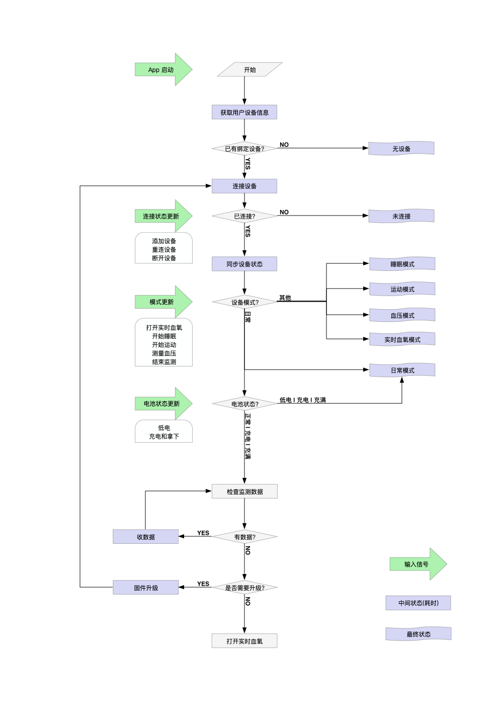

[EN](./README.md) | 中文

## 更新日志
|版本|说明|时间|
|:-:|-|:-:|
|1.12.6| 解决在解析数据的时候，在网络出错时不能解析数据的问题 |2022/12/29|
|1.12.5| 收取完指环数据之后，添加睡眠、HRV、运动的报告详情UI页面 |2022/11/15|
|1.12.4| 解决不同指环广播数据不同解析sn不同的问题(主要是：C11H,P11G,P11H型号) |2022/11/9|
|1.12.3| 解决设备为nil时手动断开发生崩溃 |2022/9/21|
|1.12.2| 开启Bitcode |2022/08/30|
|1.12.1|5.0.11803固件版本支持关闭和打开HRV的功能.|2022/08/26|
|1.12.0|修复扫描查找旧设备和限制连接的问题.|2022/08/15|
|1.11.91|添加README文件及项目接口的一些注释说明|2022/07/19|
|1.11.9|更新解析数据的算法（算法版本：11737). |2022/07/07|
|1.11.8|1.在Demo中添加如何在设备断开连接后重新连接，以及收集数据的简单过程（点击停止监测时收集数据） 2.添加是否支持血压测量属性和ECG的一些描述.|2022/07/03|
|1.11.72|进一步对ECG的描述说明|2022/03/03|
|1.11.7|在Demo中添加测试血压监测功能及UI   产生ECG数据后，对ECG进行UI的绘制详情等|2022/04/20|
|1.11.61|解决电量老是出现百分之五十的bug|2022/04/08|
|1.11.5|验证SDK的AppId和AppKey添加回调功能. |2022/02/25|
|1.11.4|修复启动GLUMode的方法的失败故障 |2022/02/24|
|1.11.3|修复产生HRV数据后，不能解析的问题 |2022/02/22|
|1.11.2|修复在获取指环数据的时候，进度条超出的bug|2022/01/28|
|1.11.1|1.添加开启和关闭日志的功能   2.对解析HRV的数据的时间进行修改|2022/01/12|

......  更多请查看发布的 release 列表.

MegaRing SDK & Demo for iOS in Objective-C

请向官方提供自己的包名(即BundleId)，来获取有效AppID和AppKey,SDK不支持模拟器，请使用真机进行调试;

为了更容易理解硬件和 SDK 的使用, 下面给出了指环的几个特征和 SDK 一些组件的说明;

## 关于指环
### 连接和用户身份校验
- 已绑定用户连接时需要提供用户 id 和 token, 新用户连接只需要提供 id; 
- 连接完成后会生成一个 token, 以供下次连接使用;

### 监测
- 连接指环后可以通过手机开关监测; 
- 开启实时数据的作用是每秒收到血氧和脉率的值; 
- 监测可能在一些情况下自动结束, 如低电, 充电, 空间已满, 超过 12 小时等;

### 数据
- 每监测 82 秒产生 256 字节的数据; 
- 结束监测时指环里会保存这次监测的数据, 其中不足 256 字节的部分会被舍去; 
- 数据在被收取后自动删除; 
- 指环内部空间能存储 12 小时的睡眠监测, 建议在开始新的监测前检查收取数据;

## 关于 SDK

### 初始化

	+[MRApi setUpWithAppId:appKey:completion:]; (在MRApi.h中有说明的回调结果)

### 连接过程

1. 注册通知 kMRCentralStateUpdatedNotification 可以观察系统蓝牙的状态; 设置 [MRConnecter defaultConnecter].delegate;
2. 调用 -[MRConnecter startScanning] 开始扫描设备, 确保设备电量充足并在可连接范围内;
3. 实现 -[MRConnecterDelegate connecter:didDiscoverDevice:], 设备被搜索到时会调用此方法;
4. 搜索到目标设备后调用 -[MRConnecter connectDevice:] 连接该设备;
5. 实现 -[MRConnecterDelegate connecter:didUpdateDeviceConnectState:], 设备被连接后会调用此方法;
6. 调用 -[MRConnecter stopScanning] 停止扫描，或者通过设置 `autoStopScanning = true` 在连接设备后自动终止扫描;

### 绑定过程

1. 设置 MRDevice.delegate;
2. 实现 -[MRDeviceDelegate bindUserIdentifier] 和 -[MRDeviceDelegate bindToken], 提供绑定用户的身份和 token 来验证是不是新用户。userid 格式是24位16进制字符串，token 在首次绑定获得;
    提示：[userId是服务器返回给App的，然后bind设置给指环；您可以在让服务端生成返回给App -- 24位16进制字符串 (让服务端在网上搜，有很多)]; （ 示例: @"5a4331011579a30038c790de" ）
3. 实现 -[MRDeviceDelegate bindDeviceResp:] 接收验证结果, 老用户每次连接过程中只调用一次, 返回 MRBindRespOld 表示验证成功; 新用户完成连接过程中会调用三次, 若收到 MRBindRespChangeUser, 实现 -[MRDevice confirmChangingUser:] 决定是否继续连接, 若传入 YES, 会再收到 MRBindRespShake, 表示需要晃动指环来确认, 此时晃动指环, 最后收到 MRBindRespNew, 表示指环和新用户的绑定完成;
4. 实现 -[MRDeviceDelegate finishBindingWithToken:] 接收指环与新用户绑定后生成的 token; 
5. 实现 -[MRDeviceDelegate bindUserInfo] 设置用户体征信息;
6. 开发提示：最好把连接的设备封装成单利...。
### 设备状态

MRDeviceDelegate 中也声明了一些用来获取指环实时状态的方法, 如下:
	
	- (void)deviceDidUpdateConnectState; // 设备连接的状态
	- (void)deviceIsReady:(BOOL)isReady; // 您可以查看指环的硬件是否是好的 。isReady == YES, 设备的硬件没有问题。
	- (void)deviceInfoUpdated; // btVersion, hwVersion, swVersion...
	- (void)deviceBatteryUpdated; // batState batValue
	- (void)liveDataStateUpdated; // MRLiveDataState
	- (void)monitorStateUpdated; // isMonitorOn
	- (void)liveDataValueUpdated:(NSArray *)liveData; // [血氧,脉率,有效性,监测时长,accx,accy,accz]
<!--	- (void)deviceModeUpdated; // MRDeviceMode-->
    - (void)monitorModeUpdated; // MRDeviceMode--> 当设备模式切换成功后，会走此代理方法(即监测的模式发生改变的时候) -- 比如从睡眠监测到关闭监测或从normal到开启监测成功后,您可以查看当前的模式。 
    
	- (void)screenStateUpdated; // isScreenOff
	- (void)operationFailWithErrorCode:(MRErrCode)errCode; 
	- (void)rawdataUpdated:(NSArray *_Nullable)data; // 只对某些版本开放
	- (void)bpDataUpdated:(NSData *)data // 接收血压测量数据

### 设备控制
1. 调用 -[MRDevice switchToSleepMode] 来开启睡眠监测(至少监测30分钟得到有效数据);
2. 调用 -[MRDevice switchToSportMode] 来开启运动监测（监测至少10分钟得到有效数据）;
3. 调用 -[MRDevice switchToRealtimeMode] 来开启实时监测;
4. 调用 -[MRDevice switchToPulseMode] 来开启脉诊仪模式--- 可以打开 [MRDevice setRawdataEnabled:YES]查看数据。
5. 调用 -[MRDevice switchToNormalModel] 关闭监测;
6. 调用 -[MRDevice startLiveData] 开启实时数据后, 监测状态下会每秒上报一组数据, 需要实现 -[MRDeviceDelegate liveDataValueUpdated:];
7. 调用 -[MRDevice endLiveData] 关闭实时数据;
8. 调用 -[MRDevice setRawdataEnabled:] 开关原始数据上报，目前支持睡眠，运动，脉诊仪几种模式;
9. 调用 -[MRDevice setPeriodicMonitorOn:afterSeconds:duration:repeat:] 来设置定时监测，参数分别为开/关，开始时间距离现在的秒数，监测持续时长，是否每天重复;
10. 调用 -[MRDevice getMonitorTimer] 来获取定时监测的状态;
11. 调用 -[MRDevice clearCache] 清除指环中的监测数据，版本在11312及以下的固件不支持此功能。
12. 调用 -[MRDevice switchToBPMode] 测量血压，见 DeviceManagerViewController.m。
13. 调用 -[MRDevice setHrvModeEnable:] 设置YES 或 NO,来判断是否开启HRV功能；点击睡眠的时候默认是开启HRV功能的，当关闭HRV功能可以节约电池的电量; 注意：只有是28指环（支持血压监测功能的指环），而且固件版本大于等于5.0.11803的时候，才支持开关HRV功能. （如何判断请看demo.）

### 数据处理
1. 调用 -[MRDevice requestData:progress:finish:] 检查和收取设备中的数据, 建议重复调用此方法, 直至得到的 data 为空, 即设备中数据已被全部取出; (可以查看Demo中的使用)
	1. MRDataTypeMonitor 运动、睡眠监测数据
	2. MRDataTypeDaily 日常监测数据
    3. MHBLEDataRequestTypeHRV 是28指环（它支持血压监测的指环），它开启睡眠的时产生的HRV数据。   
    3. 为防止一直同步数据操作，在finish：后添加 xxxDevice.isDownloadingData = NO，多次调用此方法时，调用此方法前要判断 xxxDevice.isDownloadingData = YES时，进行return操作防止正在进行的同步数据操作，（可看DeviceManagerViewController+Methods.h实例的使用）;
2. 调用 +[MRApi parseMonitorData:completion:] 解析数据 及(HRV数据), 生成 report;
3. 调用 +[MRApi parseBPData:time:caliSBP:caliDBP:block:] 解析血压数据, 生成血压测量报告;

     3.1   注意:  +[MRApi parseMonitorData:completion:] 和
                  +[MRApi parseBPData:time:caliSBP:caliDBP:block:]方法
                  在SDK v1.12.6及以后不再需要通过网络验证AppID和AppKey了，只要[MRApi setUpWithAppId: appKey: completion:]验证成功就可以使用了。

4. 调用 +[MRApi parseDaily:data] 解析日常数据，获得体温等数据，只在睡眠监测期间有温度数据;
5. 当生成HRV数据报告时 +[MRApi parseMonitorData:completion:] 解析数据后，生成HRV的报告,可以查看 (MRReport.h) 的属性说明。
6. HRV的说明：开启睡眠监测之后，当[手指与指环保持静止不动]至少28分钟，会产生HRV的数据。（测试的时候，不是很好测量，最好长时间进行测试，因为短时间测试手指晃动了可能就不会产生HRV数据了，建议带回家睡觉的时候开启睡眠监测，第二天开始收数据）。

7.   ECG的说明: 开启血压检测完成之后，解析数据得到ECG数据 [开启血压监测，测量完成之后查看ecg的UI绘制详情]。

### 固件升级
1. 使用 MRDeviceUpgrader 类来升级固件;
2. 连接设备后, 指定需要升级的设备 device 固件 firmware, 调用 -[MRDeviceUpgrader start] 开始升级;
3. 实现 MRDeviceUpgraderDelegate 的方法来监听升级过程的状态和进度;
4. 测试固件升级时最好[[不要从高版本固件升级到低版本固件]]可能会导致指环出错而不能使用。 

### 佩戴检测
* 可通过以下方法检测用户佩戴正确与否。
	* 切换到实时模式 `-[MRDevice switchToRealtimeMode]`。
	* 打开数据上报 `-[MRDevice startLiveData]`。
	* 通过 `-(void)liveDataValueUpdated:(NSArray *)liveData` 实时获取 ACC 值。
	* 引导用户摆出指定手势，若用户正确佩戴指环：四指向下时，accy > 0；手心向上时，accz > 0。
 ### 日志
 * 设置日志存储打印是否开启` -[MRApi setMRLogEnabled:YES].
 * 设置日志的存储路径，存储大小最大值等 ` -[MRApi setLogsPathName:@"xxxddMegaXX" tempLogFileName:@"Megaxx.txt" pathSize:500000 noTempLogFile:YES]; 
     当大于自己设置值时(500000 ---- > 500K) 会新生成文件 时间戳.txt。
 * 获取日志的路径：`[MRApi getLogsForUpload]; 
 * 删除一个日志： `-[MRApi deleteLog:@"2011111xxxx.txt"];
 * 切换生成一个新的日志txt文件: `-[MRApi switchToNewLog];
 * 也可以到（MRApi.h）去查看方法的一下注释说明。   
 
### 推荐交互流程

### 导入 Swift 工程

将 framework 文件放入 OC & Swift 工程，选择 Embed & Sign 即可。

 

-------------------------------一些说明，如下------------------------

    一. 
### ****** 开发注意---指环有时会出现断开  ****** 

    1、信号比较弱时。
    2、短时间内频繁连接。
    3、监控模式在短时间内多次切换时。
    4、绑定新设备时，戒指没有抖动。

    二. 一些结束监测的情况
        如低电, 充电, 空间已满,定时结束, 使用超过 12 小时等会结束监测-->会切换到MRDeviceMonitorModeNormal 模式;

    三. 扫描不到设备的情况：
        1. 电量过低或无电 xxDevice.batState == MRBatteryStateLowPower (== 3 低电)
        2. 设备正在连接中： 连接在其他App或自己App 都是扫描不到的。
        
    四. token 失效后： 需要重新摇晃绑定
         1. 当在其他App 连接， 再次在本App 中连接会发生token失效. 
         2. 本地存储的token 被清空时，再连接时会发生token失效.

        
    五.在开启监测使用时：[每开启一个监测模式如果指环产生的数据，就收取指环内的数据，确保在开启一种监测模式之前，指环内的数据是空的]

    六. 
     *** 提示：在(DeviceManagerViewController.m 和 DeviceManagerViewController+Methods) 中测试查看以帮助您：

            1. 关于数据的收取： 开启监测后指环产生了数据结束监测后(断电重连后，重启App后)收取指环的数据： （只要关闭监测后检查模式后，开始就收取数据) 可以查看一下简单的流程。
            
            2. Demo获取指环数据的流程：
            
            （1)先获取指环中DailyData数据----类型：MRDataTypeDaily. 
             (2)再获取指环中产生的睡眠数据---- 类型:MRDataTypeMonitor.
             (3)获取指环中HRV数据. 
             
             ---------
             
             (4)[如果您项目中不用日常DailyData或产生的HRV数据，这些数据您都不用，最好把这些数据也进行获取了；确保在开启监测之前，指环内的数据是空的.(三 解释.)] .
             
             (5)我们的App也是使用Demo收取指环数据的这个流程;当然您可以先收取MRDataTypeMonitor类型的数据，然后再收取MRDataTypeDaily类型的数据...  .
             (6)请查看Demo中方法：[-（void) requestDailySleepHRVSportDataTest 收取的数据过程及注释说明等：在 'DeviceManagerViewController+Methods.h' 中 -- 同样有对此方法的注释说明 ].
               
            3. 关于断开后重连的简单流程可以测试查看一下。
         
            
     七. 提示说明：报告字段或UI界面以供您参考.  
            7.1 如果要查看产生报告的UI详情,收取完数据后，跳转到 SleepReportViewController（睡眠报告UI详情），HRVReportViewController（HRV报告UI详情），WorkoutReportViewController（运动报告UI详情）.
            
            7.2 如果查看血压监测及血压详情的UI，TestBPViewController (血压监测的UI)，点击完成查看 BPReportViewController（血压详情UI）.
            
            
            
    

