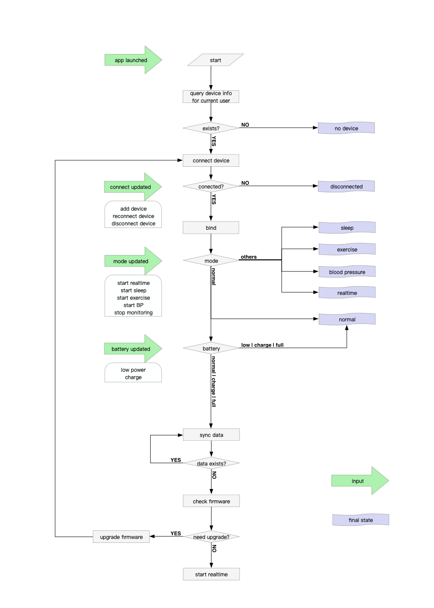
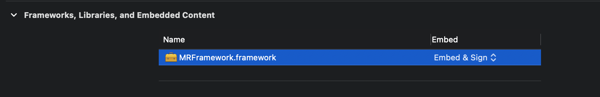

EN | [中文](./README-zh.md)

This text introduces the components of MRFramework, hoping to make it easier to use.


### Initialize

1. Import the SDK to your Project.
2. Call `+[MRApi setUpWithAppId:appKey:completion:];` to setup. Contact the SDK Provider for `id` & `key`. （Callback results described in MRApi.h）

### Connection

1. Register the notification `kMRCentralStateUpdatedNotification` to observe the cellphone bluetooth status; Assign a delegate to `[MRConnecter connecter]`.

2. If `[MRConnecter connecter].isCentralPowerOn` turns YES, call `-[MRConnecter startScanning]` to scan devices, make sure the target device has enough power and is in connectable distance.

3. Implement method `-[MRConnecterDelegate connecter:didDiscoverDevice:]`; The method will be called once a device is discovered.

4. Call `-[MRConnecter connectDevice:]` to connect the target device.

5. Implement method `-[MRConnecterDelegate connecter:didUpdateDeviceConnectState:]`, The method will be called once a device is connected.

6. Then call `-[MRConnecter stopScanning]` to stop scanning. Or set `autoStopScanning = true` to automatically stop scanning after connecting the device.


###  Binding Device & User

1. Set MRDevice.delegate.

2. Implement method `-[MRDeviceDelegate bindUserIdentifier]` and `-[MRDeviceDelegate bindToken]` to provide user id and token. The userid is a 24-bit hexadecimal string. Use the token you get in step 6 to connect the old device.

3. Implement method `-[MRDeviceDelegate bindDeviceResp:]` to observe binding response. 

4. A `MRBindRespOld` comes when the same user connect the same device. 

5. If another user try to connect the device, A `MRBindRespChangeUser` will comes at first. Then call `-[MRDevice confirmChangingUser:]` to continue(YES) or end(NO) the connection. If YES, you'll reveive `MRBindRespShake`, means user should shake the ring to confirm the connection. After the shaking, at last, it will be `MRBindRespNew`. This is the process of changing a device's user.

6. Implement method `-[MRDeviceDelegate finishBindingWithToken:]` to get the new token after changing user.

7. Implement method `-[MRDeviceDelegate bindUserInfo]` to set user physical signs.


### Device control

1. Call `-[MRDevice startLiveData]` to start the live data, implement method `-[MRDeviceDelegate liveDataValueUpdated:]`, an realtime data array will be received every second when device's monitoring.

2. Call `-[MRDevice endLiveData]` to end the live data.

3. Call `-[MRDevice switchToSleepMode]` to start sleep monitoring.（Monitor for at least 30 minutes to obtain effective data）

4. Call `-[MRDevice switchToSportMode]` to start sport monitoring.（Monitor for at least 10 minutes to obtain valid data）

5. Call `-[MRDevice switchToNormalModel]` to stop monitoring.

6. Call `-[MRDevice switchToRealtimeMode]` to start realtime monitoring.

7. Call `-[MRDevice switchToPulseMode]` to start pulse monitoring.

8. Call `-[MRDevice setRawdataEnabled:]` to enable rawData, implement method `-[MRDeviceDelegate rawdataUpdated:]` to receive rawData. Only certain versions are available.

9. Call -[MRDevice setPeriodicMonitorOn:afterSeconds:duration:repeat:] to set periodic monitor, the paras are on/off, seconds between now and start time, monitor duration, is repeat everyday;

10. Call -[MRDevice getMonitorTimer] to get current periodic monitor state;

11. Call -[MRDevice clearCache] to clear ring's monitor data if you don't want it. Software with version 11312 or less is not supported.

12. Call -[MRDevice switchToBPMode] to measure blood pressure, see  DeviceManagerViewController.m.


### Device status

This are some methods that can help getting device's status in protocol `MRDeviceDelegate`:

```
- (void)deviceDidUpdateConnectState;

- (void)deviceIsReady:(BOOL)isReady;

- (void)deviceInfoUpdated; // btVersion, hwVersion, swVersion...

- (void)deviceBatteryUpdated; // batState batValue

- (void)liveDataStateUpdated; // MRLiveDataState

- (void)monitorStateUpdated; // isMonitorOn

- (void)liveDataValueUpdated:(NSArray *)liveData; // [SpO2, PR, state, duration, accx, accy, accz]

- (void)deviceModeUpdated; // MRDeviceMode

- (void)screenStateUpdated; // isScreenOff

- (void)operationFailWithErrorCode:(MRErrCode)errCode; 

- (void)rawdataUpdated:(NSArray *_Nullable)data; 

- (void)bpDataUpdated:(NSData *)data // receive blood pressure data
```


### Data processing

1. Call `-[MRDevice requestData:progress:finish:]` to get data from device. Call it again until the data is nil, which means there is no more data in it.
	1. MRDataTypeMonitor, sport & sleep data
	2. MRDataTypeDaily, daily data
    3. To prevent data operations from being synchronized all the time, after method finish: add xxxDevice.isDownloadingData = NO， Judge before calling this method：  when xxxDevice.isDownloadingData = YES，The return operation prevents ongoing data synchronization operations，（See DeviceManagerViewController+Methods.h use of instances）.   

2. Call `+[MRApi parseMonitorData:completion:]` to parse data (And HRV data), you will receive a `MRReport` object.

3. Call `+[MRApi parseBPData:time:caliSBP:caliDBP:block:]` to parse blood pressure data.

4. Call +[MRApi parseDaily:data] to parse daily data, then you'll get temperature data, only valid duration sleep monitoring;
5. When generating an HRV data report, call + [MRApi parsemonitordata: completion:] to parse the data and generate an HRV report. You can view the attribute description of ([MRReport.h]).

6. Description of HRV: after turning on sleep monitoring, HRV data will be generated when [fingers and rings remain stationary] for at least 28 minutes. (during the test, it's not easy to measure. It's best to test for a long time, because the HRV data may not be generated if the test finger shakes for a short time. It's recommended to start sleep monitoring when taking it home to sleep and collect the data the next day).

7. ECG Description: after the blood pressure detection is started, the ECG data is obtained by analyzing the data.


### Device upgrade
1. Use class `MRDeviceUpgrader` to upgrade device's firmware.
2. After device connected, assgin a firmware's absolute path to `-[MRDeviceUpgrader defaultInstance]`, then call `-[MRDeviceUpgrader start]` to start.
3. Implement the functions in protocol `MRDeviceUpgraderDelegate` to observe the status of the upgrade.
4. It is better to [#[do not upgrade from high version firmware to low version firmware]#] when testing firmware upgrade, which may cause ring error and cannot be used.

### Wearing Test
* The method to detect whether the user wears it correctly or not.
	* Switch to realtime mode `-[MRDevice switchToRealtimeMode]`.
	* Enable data notifying `-[MRDevice startLiveData]`.
	* Get acc values `-(void)liveDataValueUpdated:(NSArray *)liveData`.
	* Guide user to pose the specified gestures. If the user wears the ring correctly: accy > 0 when fingers point to the ground; accz > 0 when Palms up.

 ### Log   
 * Set whether log storage printing is enabled ` -[MRApi setMRLogEnabled:YES].
 * Set the storage path size and content of logs  ` -[MRApi setLogsPathName:@"xxxddMegaXX" tempLogFileName:@"Megaxx.txt" pathSize:500000 noTempLogFile:YES];  When it is greater than the set value (500000 ---- > 500K), a new file timestamp will be generated txt。。
    
 * Path to get log: `[MRApi getLogsForUpload]; 
 * Delete a log: `-[MRApi deleteLog:@"2011111xxxx.txt"];
 * Switch to generate a new log TXT file: `-[MRApi switchToNewLog]

 * For the log, you can also go to (MRApi.h) to view the annotation description of the method

### Recommended Workflow




### For Swift project

You just need to put the ".framework" file into your project and select Embed & Sign.  


